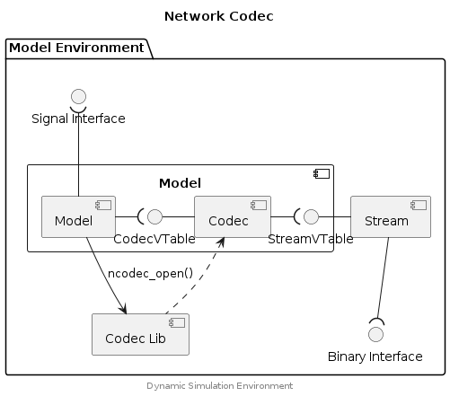

## Network Codec


A Network Codec has two interfaces: a Codec Interface which is used to
encode/decode message from a Model/Device (connected to a Network), and a
Stream Interface which is used to exchange the encoded messages with other
Model/Devices connected to the same Network.

The Network Codec API (codec.h & codec.c) provides the framework
for implementing both the Codec Interface and the Stream Interface.
A typical realisation of this scheme would be:

* Stream Implementation - provided by the Model Environment.
* Network Codec Implementation - provided by a Codec vendor.
* Model - using the Network Codec API to configure and use a Network, with
  the assistance of both the Network Codec and Stream implementations.


### Component Diagram

<div hidden>

```
@startuml ncodec-component

title Network Codec

package "Model Environment" {
    interface "Signal Interface" as Sif
    component "Model" as foo {
    		component "Model" as Model
    		interface "CodecVTable" as Cvt
    		component "Codec" as Codec
        interface "StreamVTable" as Svt
    }
    component "Stream" as Stream
    interface "Binary Interface" as Bif
    component "Codec Lib" as lib
}

Sif )-down- Model
Model -right-( Cvt
Cvt -right- Codec
Codec -right-( Svt
Svt -right- Stream
Stream -down-( Bif

lib .up.> Codec

Model --> lib :ncodec_open()

center footer Dynamic Simulation Environment

@enduml
```

</div>




### Example





## Typedefs

### NCodecConfigItem

```c
typedef struct NCodecConfigItem {
    const char* name;
    const char* value;
}
```

### NCodecInstance

```c
typedef struct NCodecInstance {
    const char* mime_type;
    NCodecVTable codec;
    NCodecStreamVTable* stream;
}
```

### NCodecMessage

```c
typedef struct NCodecMessage {
    uint32_t frame_id;
    uint8_t* buffer;
    size_t len;
}
```

### NCodecStreamVTable

```c
typedef struct NCodecStreamVTable {
    NCodecStreamRead read;
    NCodecStreamWrite write;
    NCodecStreamSeek seek;
    NCodecStreamTell tell;
    NCodecStreamEof eof;
    NCodecStreamClose close;
}
```

### NCodecVTable

```c
typedef struct NCodecVTable {
    NCodecConfig config;
    NCodecStat stat;
    NCodecWrite write;
    NCodecRead read;
    NCodecFlush flush;
    NCodecTruncate truncate;
    NCodecClose close;
}
```

## Functions

### ncodec_close

#### Parameters

nc (NCODEC*)
: Network Codec object.


### ncodec_config

Set an additional parameter on a Network Codec. If the parameter is already
specified in the MIMEtype of the codex, the value being set will take
priority over the value originally specified in the MIMEtype.

#### Parameters

nc (NCODEC*)
: Network Codec object.

item (NetworkConfigItem)
: The config item being set.


### ncodec_create

> Implemented in Codec library.

#### Parameters

mime_type (const char*)
: The MIMEtype specifier.

#### Returns

NCodecOpen (pointer)
: Returns a pointer to a codec function which can open the specified MIMEtype.

NULL
: This codec library does not support the specified MIMEtype.


### ncodec_flush

#### Parameters

nc (NCODEC*)
: Network Codec object.

#### Returns

0
: The Network Codec internal buffers were flushed to the connected stream.

-ENOSTR
: The object represented by `nc` does not represent a valid stream.

-ENOSR
: No stream resource has been configured.


### ncodec_load

> Implemented by integrator.

#### Parameters

filename (const char*)
: Name of the Network Codec library to load.

hint (const char*)
: Optional path from where to load the Network Codec.

#### Returns

0
: The Network Codec library way successfully loaded.

-1
: The Network Codec library could not be loaded. Inspect `errno` for more
  details.


### ncodec_open

> Implemented by integrator.

#### Parameters

name (const char*)
: A name associated with the codec instance being opened.

mime_type (const char*)
: The MIMEtype specifier.

#### Returns

NCODEC (pointer)
: Object representing the Network Codec.

NULL
: The Network Codec could not be created. Inspect `errno` for more details.

#### Error Conditions


Available by inspection of `errno`.

ELIBACC
: Static library(ies) not loaded.

EINVAL
: Stream parameter not valid.

ENODATA
: A Network Codec matching the MIMEtype could not be found.

ENOENT
: The `ncodec_create` was not found in any loaded static library.


### ncodec_read

Read messages from a Network Codex until the stream represented by the codec
is fully consumed (i.e. no more messages).

The codec owns the message buffer/memory returned by this function. Messages
should be consumed immediately within a sequence of calls to ncodec_read (e.g.
until ENOMSG), or duplicate the messages for later processing.

#### Parameters

nc (NCODEC*)
: Network Codec object.

msg (NCodecMessage*)
: (out) The message representation to write to the Network Codec. Caller owns
  the message buffer/memory.

#### Returns

<int>
: The number of bytes read from the Network Codec. Will be identical to the
  value returned in `msg.len`.
  Additional messages may remain on the Network Codec, after processing this
  message, repeat calls to `ncodec_read` until -ENOMSG is returned.

-ENOMSG
: No message is available from the Network Codec.

-ENOSTR
: The object represented by `nc` does not represent a valid stream.

-ENOSR
: No stream resource has been configured.

-EINVAL
: Bad `msg` argument.


### ncodec_stat

#### Parameters

nc (NCODEC*)
: Network Codec object.

index (int*)
: (out) Index of the config item returned by this call. When there are no more
  config items to be returned, this value is set to -1 and an empty
  NetworkConfigItem object is returned.

#### Returns

NetworkConfigItem
: A config item.


### ncodec_truncate

#### Parameters

nc (NCODEC*)
: Network Codec object.

#### Returns

0
: The Network Codec internal buffers were truncated.

-ENOSTR
: The object represented by `nc` does not represent a valid stream.

-ENOSR
: No stream resource has been configured.


### ncodec_write

Write the provided message to the Network Codec object.

The caller owns the message buffer/memory and the codec implementation will
encode (i.e. duplicate) the content of that message buffer/memory during this
call.

#### Parameters

nc (NCODEC*)
: Network Codec object.

msg (NCodecMessage*)
: The message representation to write to the Network Codec. Caller owns the
  message buffer/memory.

#### Returns

+VE (int)
: The number of bytes written to the Network Codec. Will be identical to the
  value provided in `msg.len`.

-ENOSTR
: The object represented by `nc` does not represent a valid stream.

-EINVAL
: Bad `msg` argument.


