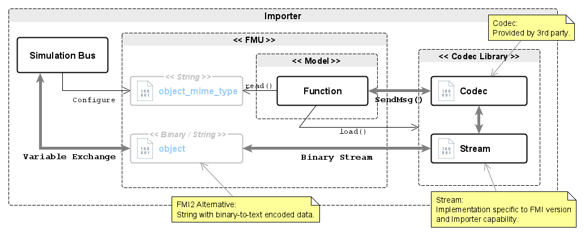

<!--
SPDX-FileCopyrightText: 2023 Robert Bosch GmbH

SPDX-License-Identifier: Apache-2.0
-->

# Dynamic Simulation Environment - FMI Layered Standard Binary Codec Selection


__Contents__
- [Introduction](#introduction)
- [Layered Standard Manifest File](#manifest)
- [Common Concepts](#concepts)
- [FMU with Binary Codec Selection](#codec)
- [Known Limitations of this Standard](#limitations)

---

<a name="introduction"></a>

## 1. Introduction

### 1.1 Intent of this Document

FMUs may contain models (and functions) which exchange data and state as serialized binary objects (e.g. CAN Bus messages). Those binary objects may be represented, and communicated, by an FMU using a Binary Variable with an associated MIME type, or a String Variable with an appropriate binary-to-text encoding. The MIME type will be implemented by a coder/decoder (codec) and encapsulated in to a driver. The driver makes it possible for a model function to interact with its internal representation of a binary object _without_ prior knowledge of the codec (or MIME type) being used to exchange those binary objects with other models in a simulation.

This layered standard describes how that codec (driver) can be selected at runtime, as well as outlining how an FMU Exporter may enable an FMU Importer (or another third-party) to implement their own codec. The FMU Importer is thus able to affect the MIME type used by an FMU for exchanging binary objects by selecting a particular codec, using the technique of dependency injection.


### 1.2 Overview of the Approach

The general approach is as follows:

1. The FMU Exporter produces an API which allows a third-party to implement a driver containing a particular codec (or several codecs). That API may include a subset of FMI functions (e.g. `fmi3GetBinary()`).

2. An Integrator implements a Stream Driver to facilitate the exchange of binary streams, and which supports a specific FMI Version and Importer capability. The stream (driver) is combined with a specific codec (or several codecs), using the API provided by the FMU Exporter, to produce the final Codec Library. The Codec Library is packaged into the FMU at an appropriate location.

3. The FMU Importer configures the Binary or String variable representing a binary object, via its associated MIME type, to load a particular codec (from the Codec Library). After the codec is loaded the FMU will use that codec for all exchanges of serialized binary objects, the codec itself will facilitate the exchange by using the binary streams (of the codec) and the related Importer variable exchange mechanism.


### 1.3 Remarks regarding this Approach

This layered standard does not define the method or design of the API which the FMU Exporter provides for the implementation of a Stream Driver. There is no change to the existing semantics of the FMI Specification.


---
<a name="manifest"></a>

## 2. Layered Standard Manifest File

This layered standard defines additional capability flags:


| Attribute   | Description |
| ----------- | ----------- |
| version | Version of this layered standard which the FMU implements. |
| supportsMimeTypeValueReference | Indicates that a MIME type may be referenced from a String variable using the Value Reference (VR) of that String variable. |
| supportsMimeTypeNamedReference | Indicates that a MIME type may be referenced from a String variable using the Name of that String variable. |
| referencedMimeTypeRequired | Indicates that a referenced to a String Variable containing the MIME type is required by the FMU. |


The manifest schema may be found here: [schema/fmi-ls-binary-codec.xsd](schema/fmi-ls-binary-codec.xsd)


---
<a name="concepts"></a>

## 3. Common Concepts

### 3.1 Structure of the FMU Archive


```
documentation
    fmi-ls-binary-codec{.md,.txt,.html}     // Documentation describing how a codec may be implemented using the driver API.

extra/dse.standards/binary-codec/
    fmi-ls-xcp-manifest                     // The layered standard manifest file.
extra/dse.standards/binary-codec/include
    (interface|api).h                       // Headers describing the driver API provided by this FMU.
extra/dse.standards/binary-codec/example
    <codec>.c                               // Example implementation of a codec using this driver API (optional).

resources/dse.standards/binary-codec/<codec>    // Implementation of a particular codec.
    <codec>{.md,.txt,.html}                     // Documentation regarding the codec (optional).
    x86_64-linux
        <codec>.so                              // Codec driver for Linux on Intel 64 (optional).
        lib<codec>.so                           // Codec driver, alternative name (optional).
    x86_64-windows
        <codec>.dll                             // Codec driver for Windows on Intel 64 (optional).
    schemas
        schema{.fbs,.yaml,xsd}                  // Schema describing the implemented codec (optional).
    source
        <codec>.c                               // Source code of the implemented codec (optional).
```


### 3.2 Documentation

The FMU Exporter should produce a documentation package with the following content:

* Instructions on how to use the driver API to write a codec driver.
* Information on how to build a codec driver so that the FMU can load it.
* Provide a minimal working example of a codec driver.

The documentation package and examples may be included with the FMU of provided on-line.

Individual codecs may be documented as required.


### 3.3 Header Files and Examples

The FMU should include header files which describe the driver API(s) provided by the FMU. It is recommended to also provide a minimal example which shows how a codec is expected to be implemented.


### 3.4 Codec Schemas

For each codec included or developed for an FMU it is necessary to include (or reference) the schema which the codec implements.


### 3.5 Codec Source Code

If an FMU is delivered with source code then it is suggested to also deliver the source code of any included codecs.


---
<a name="codec"></a>

## 4. FMU with Binary Codec Selection

An FMU may use parameters encoded in the MIME type to select and load a particular codec to be used for a binary object variable of that FMU. The codec may be provided by the FMU Importer or some other third-party.

This method allows the codec/schema of a binary object to be selected at runtime.

_Figure 1 shows the principle of Binary Codec Selection._



__Figure 1: Binary Codec Selection__

### 4.1 Configuration of Codec Selection

#### 4.1.1 Codec Selection

A codec is selected by configuring the related MIME type parameters of the binary object variable. The following MIME type parameters are suggested for this purpose[^codec_selection]:

| Parameter   | Description |
| ----------- | ----------- |
| codec | The filename of the codec driver to be used by the FMU, without extension or lib prefix. |
| codec[-param] | Additional parameters required by the codec (optional). |


[^codec_selection]: The codec selection scheme may be adjusted by an FMU Exporter.


#### 4.1.2 MIME type Specification

The MIME type used to select a codec may be specified by one of the following methods:

1. Using the existing `mimeType` attribute of the variable which represents the binary object.

2. Adding an annotation to the variable which represents the binary object. This annotation references either the Variable Reference (number) of Variable Name (string) of _an additional_ String variable which contains the MIME type[^anno_mimetype_ref].


[^anno_mimetype_ref]: The capability of an FMU to support either of these mechanisms is indicated by the manifest file.


#### 4.1.3 Annotations for referencing MIME types

These annotations may be used to indicate that a Binary variable has its MIME type specified in an additional String variable:

| Annotation   | Description |
| ----------- | ----------- |
| dse.standards.fmi-ls-binary-codec.codec-mimetype-vref | The MIME type of this Binary variable is specified by the String variable with specified variable reference number. |
| dse.standards.fmi-ls-binary-codec.codec-mimetype-vname | The MIME type of this Binary variable is specified by the String variable with specified variable name. |


### 4.2 Codec Loading and Operation

The FMU will include the necessary implementation to load and configure a codec driver. If required the FMU will provide the codec with necessary initialisation information using mechanisms defined by the driver API.

When the MIME type used to select a codec is provided by an additional String variable (i.e. via an annotation) then the codec may, via the FMU driver API, update that MIME type String variable.

During operation the FMU will ensure that the codec operates within the existing execution semantics of the FMI specification.


### 4.3 Examples


__Example MIME types__
```
# Codec selection with specification for a particular schema implementation.
mime_type: 'application/x-automotive-bus; interface=stream; type=frame; schema=fbs; codec=vbus'

# Codec selection, unknown schema (codec selects).
mime_type: 'application/octet-stream; codec=vbus'

# Codec selection with fbs schema.
mime_type: 'application/octet-stream; schema=fbs; codec=vbus'
```


__Example Variable Annotations__

```
<?xml version="1.0" encoding="UTF-8"?>
<fmiModelDescription fmiVersion="3.0" modelName="Example">
  <ModelVariables>
    <Binary name="vbus" valueReference="1" causality="input"/>
        <Annotations>
            <Annotation type="dse.standards.fmi-ls-binary-codec.codec-mimetype-vref">2<Annotation>
            <Annotation type="dse.standards.fmi-ls-binary-codec.codec-mimetype-vname">vbus_mime_type<Annotation>
        <Annotations>
    <String name="vbus_mime_type" valueReference="2" causality="parameter" variability="tunable">
        <Start value="application/octet-stream; schema=fbs; codec=vbus"/>
    </String>
  </ModelVariables>
```


---
<a name="limitations"></a>

## 5. Known Limitations of this Standard

### 5.1 Compatibility with FMI 2 Standard

This layered standard may be applied to FMUs which implement the FMI 2.0.3 Standard (or later) with the following limitations:

* Binary data exchanged by a Codec may be represented by an FMI2 String Variable with appropriate binary-to-text encoding (e.g. ascii85).
* Codec specification via MIME type can only be achieved by using a String variable. The annotation holding a reference to this MIME Type String variable should be located on the String variable representing the binary data.
* Any files related to the codec libraries should be located in the FMU `resources/dse.standards/binary-codec/<codec>` or `extras/dse.standards/binary-codec/<codec>` folder as appropriate.
