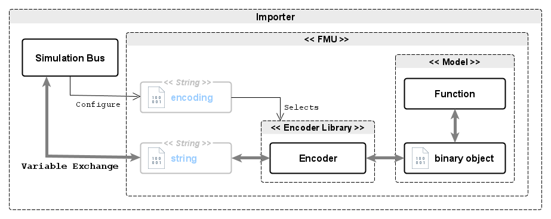

<!--
SPDX-FileCopyrightText: 2024 Robert Bosch GmbH

SPDX-License-Identifier: Apache-2.0
-->

# Dynamic Simulation Environment - FMI Layered Standard Binary-to-Text String Encoding for Binary Data


__Contents__
- [Introduction](#introduction)
- [Layered Standard Manifest File](#manifest)
- [FMU with Binary-to-Text String Encoding for Binary Data](#binary-to-text)
- [Known Limitations of this Standard](#limitations)

---

<a name="introduction"></a>

## 1. Introduction

### 1.1 Intent of this Document

FMUs may contain models (and functions) which exchange data and state as serialized binary objects (e.g. CAN Bus messages). Those binary objects may be represented, and communicated, by an FMU using a FMI Binary Variable (often with an associated MIME type), or an __FMI String Variable with an appropriate binary-to-text encoding__.

This layered standard describes how Binary Data may be binary-to-text encoded and represented with a FMI String Variable.

When combined with the [dse-standards-fmi-ls-binary-codec](../../modelica/fmi-ls-binary-codec/README.md) Layered Standard it is possible to, as an example, implement a Bus Topology that represents a CAN Network, and which exchanges CAN messages, using __only FMI String Variables__.


### 1.2 Overview of the Approach

The general approach is as follows:

1. The FMU Exporter provides an API which supports one or more binary-to-text encoders.

2. The Model Developer implements a Model Function which exchanges binary objects with the FMU runtime.

3. The FMU Exporter/Runtime configures an encoder which represents/converts binary objects from the Model as FMI String Variables. Those FMI String Variables are exchanged by the FMU Importer.


### 1.3 Remarks regarding this Approach

There are no specific remarks regarding this approach.


---
<a name="manifest"></a>

## 2. Layered Standard Manifest File

This layered standard defines additional capability flags:


| Attribute   | Description |
| ----------- | ----------- |
| version                       | Version of this layered standard which the FMU implements.
| supportsEncoderValueReference | Indicates that an encoder referenced from a String variable using the Value Reference (VR) of that String variable.
| supportsEncoderNamedReference | Indicates that encoder may be referenced from a String variable using the Name of that String variable. |
| supportedEncodings            | A list of the encoders that _this_ FMU supports. |


The manifest schema may be found here: [schema/fmi-ls-binary-to-text.xsd](schema/fmi-ls-binary-to-text.xsd)


---
<a name="binary-to-text"></a>

## 3. FMU with Binary-to-Text String Encoding for Binary Data


An FMU uses the specified encoding of an FMI String Variable to represent binary data as a text string. The encoding is specified directly, or indirectly by an associated FMI String Variable, by adding annotations to each FMI String Variable specification.

The FMU may support several encodings.

This method allows the selection of binary-to-text encoding at runtime. FMI String Variables which are exchanged between FMUs should have the same encoding configured.

_Figure 1 shows the principle of Binary-to-Text String Encoding for Binary Data._



__Figure 1: Binary-to-Text String Encoding for Binary Data__


### 3.1 Encoder API

The binary-to-text encoder API is implementation specific and an FMU may implement any kind of encoding technique/method. As an example, the ascii85 encoder used in the [dse.fmi](https://github.com/boschglobal/dse.fmi/blob/main/dse/fmimodelc/ascii85.c) project has the following API:

```c
extern char* ascii85_encode(const char* source, size_t len);
extern char* ascii85_decode(const char* source, size_t* len);
```

__Figure 2: Example encoder API (ascii85)__


#### 3.2 Configuration

A binary-to-text encoder is specified by adding the following annotations to an existing FMI String variable.


__Configuration FMI2__
> Note: annotations in FMI2 are made under the "Tool" grouping `dse.standards.fmi-ls-binary-to-text`.

| Annotation | Description |
| ---------- | ----------- |
| `encoding` | Selects the encoding to be applied to binary data represented by this FMI String Variable.
| `vref`     | The encoding is specified by the referenced (by value reference) FMI String Variable.
| `vname`    | The encoding is specified by the referenced (by variable name) FMI String Variable.

_A valid `vref` or `vname` annotation, when supported, takes priority over the `encoding` annotation._


__Configuration FMI3__

| Annotation | Description |
| ---------- | ----------- |
| `dse.standards.fmi-ls-binary-to-text.encoding` | Selects the encoding to be applied to binary data represented by this FMI String Variable.
| `dse.standards.fmi-ls-binary-to-text.vref`     | The encoding is specified by the referenced (by value reference) FMI String Variable.
| `dse.standards.fmi-ls-binary-to-text.vname`    | The encoding is specified by the referenced (by variable name) FMI String Variable.

_A valid `dse.standards.fmi-ls-binary-to-text.vref` or `dse.standards.fmi-ls-binary-to-text.vname` annotation, when supported, takes priority over the `dse.standards.fmi-ls-binary-to-text.encoding` annotation._


#### 3.3 Examples

The following example shows the configuration of a basic network connection (TX/RX) using FMI String Variables and an ascii85 encoding.


__Example Configuration FMI2__

```xml
<?xml version="1.0" encoding="UTF-8"?>
<fmiModelDescription fmiVersion="2.0" modelName="Example">
  <ModelVariables>
    <String name="binary-to-text-encoding" valueReference="1" causality="parameter"/>
    </String>
    <String name="network_tx" valueReference="2" causality="output"/>
      <Annotations>
        <Tool name="dse.standards.fmi-ls-binary-to-text">
          <Annotation name="encoding">ascii85<Annotation>
          <Annotation name="vref">1<Annotation>
          <Annotation name="vname">binary-to-text-encoding<Annotation>
        </Tool>
      <Annotations>
    </String>
    <String name="network_rx" valueReference="3" causality="input"/>
      <Annotations>
        <Tool name="dse.standards.fmi-ls-binary-to-text">
          <Annotation name="encoding">ascii85<Annotation>
          <Annotation name="vref">1<Annotation>
          <Annotation name="vname">binary-to-text-encoding<Annotation>
        </Tool>
      <Annotations>
    </String>
  </ModelVariables>
```


__Example Configuration FMI3__

```xml
<?xml version="1.0" encoding="UTF-8"?>
<fmiModelDescription fmiVersion="3.0" modelName="Example">
  <ModelVariables>
    <String name="binary-to-text-encoding" valueReference="1" causality="parameter" variability="tunable">
        <Start value="ascii85"/>
    </String>
    <String name="network_tx" valueReference="2" causality="output">
        <Annotations>
            <Annotation type="dse.standards.fmi-ls-binary-to-text.encoding">ascii85<Annotation>
            <Annotation type="dse.standards.fmi-ls-binary-to-text.vref">1<Annotation>
            <Annotation type="dse.standards.fmi-ls-binary-to-text.vname">binary-to-text-encoding<Annotation>
        <Annotations>
    </String>
    <String name="network_rx" valueReference="3" causality="input">
        <Annotations>
            <Annotation type="dse.standards.fmi-ls-binary-to-text.encoding">ascii85<Annotation>
            <Annotation type="dse.standards.fmi-ls-binary-to-text.vref">1<Annotation>
            <Annotation type="dse.standards.fmi-ls-binary-to-text.vname">binary-to-text-encoding<Annotation>
        <Annotations>
    </String>
  </ModelVariables>
```


---
<a name="limitations"></a>

## 4. Known Limitations of this Standard

There are no limitations with the application of this Layered Standard to either FMI2 and/or FMI3 simulation systems (or Importers).
