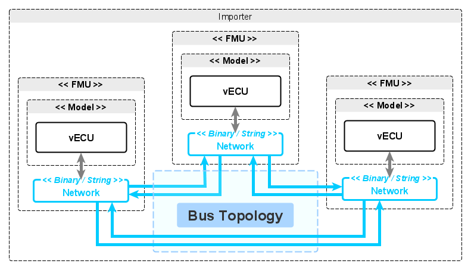

<!--
SPDX-FileCopyrightText: 2024 Robert Bosch GmbH

SPDX-License-Identifier: Apache-2.0
-->

# Dynamic Simulation Environment - FMI Layered Standard Bus Topology


__Contents__
- [Introduction](#introduction)
- [Layered Standard Manifest File](#manifest)
- [FMU with Bus Topology to realise Network](#bus-topology)
- [Example Bus Topology for CAN](#example-network)
- [Known Limitations of this Standard](#limitations)

---

<a name="introduction"></a>

## 1. Introduction

A Bus Topology may be used to define connections between FMUs where those
connections represent a Virtual Network. A Network Codec can then be used
by a Virtual ECU to connect to that Virtual Network and exchange messages
with other Virtual ECUs.

The Bus Topology is realised with FMI 2 String Variables, or
FMI 3 String/Binary Variables, and requires no special FMU Importer capabilities.

When using the DSE Network Codec a Virtual Bus FMU __is not__ required.


__Figure 1: Virtual Network based on Bus Topology & Network Codec__


The following code sample demonstrates how a Bus Topology is configured with
a [Network Codec](https://github.com/boschglobal/dse.standards/tree/main/dse/ncodec),
and then how that Network Codec is used to send (`ncodec_write()`) and
receive (`ncodec_read()`) Network Messages

```c
// Setup:
fmi2Status fmi2ExitInitializationMode(...)
{
    fmu->bus_topology = bus_topology_create(fmu->instance.model_xml_path);
    fmu->bus_ncodec = ncodec_open(MIMETYPE, stream_create());
    char* bus_id = __get_ncodec_bus_id(fmu->bus_ncodec);
        bus_topology_add(fmu->bus_topology, bus_id, fmu->bus_ncodec);
    free(bus_id);
 }
// Bus RX:
fmi2Status fmi2SetString(...)
{
    bus_topology_reset(bt);
    for (size_t i = 0; i < nvr; i++) {
        if (value[i] == NULL) continue;
        bus_topology_rx(bt, vr[i], (uint8_t*)value[i], strlen(value[i]));
    }
}

// CAN Message read/write:
fmi2Status fmi2DoStep(...)
{
    /* Read. */
    NCodecCanMessage msg = {};
    while (1) {
        int len = ncodec_read(ncodec, &msg);
        if (len < 0) break; /* No more messages. */
    }
    ncodec_truncate(ncodec);

    /* Write. */
    ncodec_write(ncodec, &(struct NCodecCanMessage){
        .frame_id = 42,
        .buffer = (uint8_t*)GREETING,
        .len = strlen(GREETING) });
    ncodec_flush(ncodec);
}

// Bus TX:
mi2Status fmi2GetString(...)
{
    for (size_t i = 0; i < nvr; i++) {
        value[i] = NULL;
        size_t len = 0;
        bus_topology_tx(bt, vr[i], (uint8_t**)&value[i], &len);
    }
}
```
__Figure 2: Example integration of Bus Topology & Network Codec APIs__


### 1.1 Intent of this Document

FMUs may be interconnected via FMI String or Binary Variables to create a Bus Topology which represents a Network (e.g. CAN Bus). That Network may be further defined by a MIMEtype where the properties of the Network may be configured. The resultant Virtual Bus, or Virtual Network, is then operated with the exchange of FMI Variables - no additional Importer capability is required.

A Virtual Bus (or Network) can be realised in FMI2 simulations using FMI String Variables, and in FMI3 simulations using either FMI String or Binary Variables. When using FMI String Variables the associated [dse-standards-fmi-ls-binary-to-text](../../modelica/fmi-ls-binary-to-text/README.md) Layered Standard is available to configure the binary-to-text encoding of messages being exchanged by the Network.

This layered standard describes the mechanism for defining a bus topology with FMI String or Binary Variables.


### 1.2 Overview of the Approach

The general approach is as follows:

1. The Model Developer implements software functions which are capable of discovering FMI Variables which represent a Bus Topology, and then operating those FMI Variables collectively as a Network Interface to a Virtual Network. This means sending network data on FMI Variables annotated as the TX direction (`causality="output"`), and receiving network data from FMI Variables annotated as the RX direction (`causality="input"`).

2. The Simulation Integrator decides on a Bus Topology and creates/modifies FMU descriptions to include the necessary FMI Variables and annotations for that Bus Topology. Connections between FMU Variables which the Importer should connect are also defined.

3. The FMU Runtime configures its Network Interfaces by parsing its Model Definition for FMI Variables that have Bus Topology annotations. The FMU is then able to exchange Network Messages with other FMUs by using those configured Network Interfaces, while the FMI Importer facilitates the Virtual Network by exchanging FMI String or Binary Variables between FMUs.


### 1.3 Remarks regarding this Approach

There are no specific remarks regarding this approach.


---
<a name="manifest"></a>

## 2. Layered Standard Manifest File

This layered standard defines additional capability flags:


| Attribute   | Description |
| ----------- | ----------- |
| version                       | Version of this layered standard which the FMU implements.


The manifest schema may be found here: [schema/fmi-ls-bus-topology.xsd](schema/fmi-ls-bus-topology.xsd)


---
<a name="bus-topology"></a>

## 3. FMU with Bus Topology to realise Network

A Bus Topology is created by annotating FMI String or Binary Variables. Those annotations represent the Bus (`bus_id`) and the Node (`node_id`) of an FMU, and all FMUs combined represent a Virtual Network. An FMU may be connected to several Virtual Networks.

The Bus topology and resultant Virtual Network is affected with the exchange of FMI Variables by the Importer.

_Figure 3 shows the principle of a Bus Topology which realises a Virtual Network._



__Figure 3: FMUs with Bus Topology to realise Network__


### 3.1 Configuration

A Bus Topology is specified by adding the following annotations to FMI String or Binary Variables. FMI Variables for all connected FMUs need to be defined in each FMU, both in the transmit and receive direction.


__Configuration FMI2__
> Note: annotations in FMI2 are made under the "Tool" grouping `dse.standards.fmi-ls-bus-topology`.

| Annotation | Description |
| ---------- | ----------- |
| `bus_id`     | Indicate the Bus Identifier that this FMI String or Binary Variable represents.
| `node_id`    | Indicate the Node Identifier assigned to this FMU for the Bus represented by this FMI String or Binary Variable.


__Configuration FMI3__

| Annotation | Description |
| ---------- | ----------- |
| `dse.standards.fmi-ls-bus-topology.bus_id`     | Indicate the Bus Identifier that this FMI String or Binary Variable represents.
| `dse.standards.fmi-ls-bus-topology.node_id`    | Indicate the Node Identifier assigned to this FMU for the Bus represented by this FMI String or Binary Variable.


### 3.2 Examples

The following example shows the configuration of a basic network connection (TX/RX) using FMI String Variables and an ascii85 encoding.


__Example Configuration FMI2__

```xml
<?xml version="1.0" encoding="UTF-8"?>
<fmiModelDescription fmiVersion="2.0" modelName="VirtualECU">
  <ModelVariables>
    <String name="network_1_1_rx" valueReference="1" causality="input"/>
      <Annotations>
        <Tool name="dse.standards.fmi-ls-bus-topology">
          <Annotation name="bus_id">1<Annotation>
          <Annotation name="node_id">1<Annotation>
        </Tool>
      <Annotations>
    </String>
    <String name="network_1_1_tx" valueReference="2" causality="output"/>
      <Annotations>
        <Tool name="dse.standards.fmi-ls-bus-topology">
          <Annotation name="bus_id">1<Annotation>
          <Annotation name="node_id">1<Annotation>
        </Tool>
      <Annotations>
    </String>
    <String name="network_1_2_rx" valueReference="3" causality="input"/>
      <Annotations>
        <Tool name="dse.standards.fmi-ls-bus-topology">
          <Annotation name="bus_id">1<Annotation>
          <Annotation name="node_id">2<Annotation>
        </Tool>
      <Annotations>
    </String>
    <String name="network_1_2_tx" valueReference="4" causality="output"/>
      <Annotations>
        <Tool name="dse.standards.fmi-ls-bus-topology">
          <Annotation name="bus_id">1<Annotation>
          <Annotation name="node_id">2<Annotation>
        </Tool>
      <Annotations>
    </String>
    <String name="network_1_3_rx" valueReference="5" causality="input"/>
      <Annotations>
        <Tool name="dse.standards.fmi-ls-bus-topology">
          <Annotation name="bus_id">1<Annotation>
          <Annotation name="node_id">3<Annotation>
        </Tool>
      <Annotations>
    </String>
    <String name="network_1_3_tx" valueReference="6" causality="output"/>
      <Annotations>
        <Tool name="dse.standards.fmi-ls-bus-topology">
          <Annotation name="bus_id">1<Annotation>
          <Annotation name="node_id">3<Annotation>
        </Tool>
      <Annotations>
    </String>
  </ModelVariables>
```


__Example Configuration FMI3__

```xml
<?xml version="1.0" encoding="UTF-8"?>
<fmiModelDescription fmiVersion="3.0" modelName="VirtualECU">
  <ModelVariables>
    <String name="network_1_1_rx" valueReference="1" causality="input">
        <Annotations>
            <Annotation type="dse.standards.fmi-ls-bus-topology.bus_id">1<Annotation>
            <Annotation type="dse.standards.fmi-ls-bus-topology.node_id">1<Annotation>
        <Annotations>
    </String>
    <String name="network_1_1_tx" valueReference="2" causality="output">
        <Annotations>
            <Annotation type="dse.standards.fmi-ls-bus-topology.bus_id">1<Annotation>
            <Annotation type="dse.standards.fmi-ls-bus-topology.node_id">1<Annotation>
        <Annotations>
    </String>
    <String name="network_1_1_rx" valueReference="3" causality="input">
        <Annotations>
            <Annotation type="dse.standards.fmi-ls-bus-topology.bus_id">1<Annotation>
            <Annotation type="dse.standards.fmi-ls-bus-topology.node_id">2<Annotation>
        <Annotations>
    </String>
    <String name="network_1_1_tx" valueReference="4" causality="output">
        <Annotations>
            <Annotation type="dse.standards.fmi-ls-bus-topology.bus_id">1<Annotation>
            <Annotation type="dse.standards.fmi-ls-bus-topology.node_id">2<Annotation>
        <Annotations>
    </String>
    <String name="network_1_1_rx" valueReference="5" causality="input">
        <Annotations>
            <Annotation type="dse.standards.fmi-ls-bus-topology.bus_id">1<Annotation>
            <Annotation type="dse.standards.fmi-ls-bus-topology.node_id">3<Annotation>
        <Annotations>
    </String>
    <String name="network_1_1_tx" valueReference="6" causality="output">
        <Annotations>
            <Annotation type="dse.standards.fmi-ls-bus-topology.bus_id">1<Annotation>
            <Annotation type="dse.standards.fmi-ls-bus-topology.node_id">3<Annotation>
        <Annotations>
    </String>
  </ModelVariables>
```


---
<a name="example-network"></a>

## 4. Example Bus Topology for CAN

### 4.1 CAN Network with Network Codec based Virtual Network

_Figure 4 demonstrates a Bus Topology that represents a Network Codec based Virtual Network._


__Figure 4: Network Codec based Virtual Network__


### 4.2 CAN Network with FMU based Virtual Network

_Figure 5 demonstrates a Bus Topology that represents an FMU based Virtual Network._


__Figure 5: FMU based Virtual Network__


---
<a name="limitations"></a>

## 4. Known Limitations of this Standard

There are no limitations with the application of this Layered Standard to either FMI2 and/or FMI3 simulation systems (or Importers).
