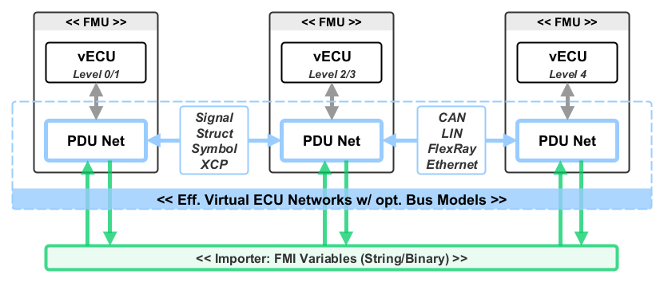
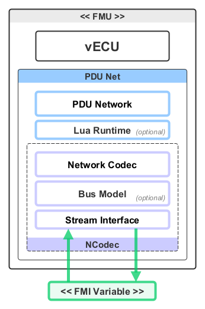

<!--
Copyright 2026 Robert Bosch GmbH

SPDX-License-Identifier: Apache-2.0
-->

# Dynamic Simulation Environment - FMI Layered Standard PDU Network

__Contents__
- [Introduction](#introduction)
- [Layered Standard Manifest File](#layered-standard-manifest-file)
- [FMU with PDU Net](#fmu-with-pdu-net)
  - [Topology: PDU Net with Network Bus](#topology-pdu-net-with-network-bus)
  - [Topology: PDU Net with Embedded Simulation](#topology-pdu-net-with-embedded-simulation)
  - [Topology: PDU Net with Bus Topology](#topology-pdu-net-with-bus-topology)
- [Reference Material](#reference-material)
  - [MIME types](#mime-types)
  - [Configuration](#configuration)
  - [Examples](#examples)
- [Known Limitations of this Standard](#known-limitations-of-this-standard)

---

## Introduction

This layered standard for FMI2/3 defines how to implement a PDU based Virtual Network (PDU Net) which
allows for the exchange of PDU based data between Virtual ECUs represented as FMUs. These Virtual Networks can
represent Automotive Networks (CAN, FlexRay, LIN, Ethernet) and ECU Networks (Signal, Struct, Symbol, XCP).



__Figure 1: Using PDU Net to build Virtual Networks in a Simulation [^hil].__

Several related technologies are integrated by this layered standard:

* FMI related integrations are provided by [DSE FMI][dse-fmi]
* PDU Net is provided by the [DSE ModelC][dse-modelc]
* NCodec is provided by the [DSE NCodec][dse-ncodec]
* The schemas used by PDU Net are available in the [Automotive Bus Schema][automotive-bus-schmea-pdu-stream]


### Intent of this Document

Virtual ECUs, packaged as FMI2/3 FMUs, are connected with Virtual Networks using PDU Net. The Virtual Networks themselves
may be configured with Bus Models to create accurate Virtual Bus Simulations. The PDU Net may also include a Lua Runtime
which can be used to modify/emulate/augment Virtual Bus Simulations for a variety of use cases (e.g. fault injection).


This document describes how FMUs which implement the PDU Net stack may be interconnected to produce a Virtual Network.

A PDU Network can be realised in FMI2 simulations using FMI String Variables, and in FMI3 simulations using either FMI String or Binary Variables. When using FMI String Variables the associated [dse-standards-fmi-ls-binary-to-text](../../modelica/fmi-ls-binary-to-text/README.md) Layered Standard is available to configure the binary-to-text encoding of messages being exchanged by the Importer.


### Overview of the Approach

The general approach is as follows:

1. The FMU Integrator incorporates the PDU Net software stack into their FMU/vECU.

2. The Simulation Developer configures the FMU Importer, and associated FMUs, according to one of the suggested Topologies.

3. The Simulation Engineer uses the Lua Script capabilities of the PDU Net to introduce simulation conditions (i.e. fault injection).

4. The Simulation Operator composes and runs the simulation using the FMU Importer.


## Layered Standard Manifest File


| Attribute | Namespace | Value |
| --------- | --------- | ----- |
| fmi-ls-name | http://fmi-standard.org/fmi-ls-manifest | dse.standards.fmi-ls-pdu-net
| fmi-ls-version | http://fmi-standard.org/fmi-ls-manifest | 1.0.0
| fmi-ls-description | http://fmi-standard.org/fmi-ls-manifest | Layered standard defining how to implement a PDU based Virtual Network (PDU Net).


## PDU Net Software Stack

The PDU Net Software Stack has the following elements:

* __Virtual ECU__ - Level 0-4 vECUs may be interfaced with the PDU Net. Physical ECUs may also be connected to a PDU Net.
* __PDU Network__ - Omplements I-PDU interface (signals), L-PDU (network), PDU Pack/Unpack (including M-PDU and Containers) and scheduling.
* __Lua Runtime__ - Supports network simulation including: fault injection, payload modification, security (e.g. checksums) and message generation.
* __Network Codec__ - PDU messaging interface with simple file-like API.
* __Bus Model__ - Supports hi-fidelity bus simulations (e.g. FlexRay) where bus-effects (e.g. bus arbitration) can be effectively simulated.
* __Stream Interface__ - Implements the underlying stream interface used by the Network Codec.
* __FMI Variable__ - The PDU Net can be adapted to either FMI String or Binary variables (one each for the Tx/Rx direction).




__Figure 2: The PDU Net Software Stack. Optional elements are used to create hi-fidelity Bus Simulations.__

The entire PDU Net software stack may be integrated from:

* [DSE NCodec][dse-ncodec]
* [DSE ModelC - PDU Net][dse-modelc]


## FMU with PDU Net

### Topology: PDU Net with Network Bus

In this topology the Network Data Exchange between Virtual ECUs is facilitated by an
FMU which implements a Network Bus [^netbus]. The Network Bus makes sure that PDU Net message streams
are exchanged and distributed between Virtual ECUs. Connections between Virtual ECUs and
the Network Bus are facilitated by the Importer using String or Binary variables.

This is a simple point to point topology.

![PDU Net with Embedded SimBus][pdunet-embedded-simbus]

__Figure 3: PDU Net with Network Bus__


### Topology: PDU Net with Embedded Simulation

In this topology an Embedded (DSE) Simulation is coupled to a Network Bus, and then interconnected
with other Virtual ECUs. The Network Bus makes sure that PDU Net message streams
are exchanged with the Embedded Simulation Virtual ECUs. Connections between Virtual ECUs and
the Network Bus are facilitated by the Importer using String or Binary variables.

This is a simple point to point topology.

![PDU Net with Embedded Simulation][pdunet-embedded-simulation]

__Figure 4: PDU Net with Embedded Simulation__


### Topology: PDU Net with Bus Topology

This topology is based on the the associated [Bus Topology][ls-bus-topology] Layered Standard where
Virtual ECUs are connected without the assistance of a Network Bus. Connections between Virtual ECUs
are facilitated by the Importer using String or Binary variables.

This is a less efficient multi-point topology.

![PDU Net with Bus Topology][pdunet-bus-topo]

__Figure 5: PDU Net with Bus Topology__


## Reference Material

### MIME types

MIME types for PDU Net use the __PDU Interface__ as described in the [AB Codec][ab-codec] documentation
of the [DSE Ncodec][dse-ncodec] repository.


### Configuration

__Configuration FMI2__
> Note: annotations in FMI2 are made under the "Tool" grouping `dse.standards.fmi-ls-pdu-net`.

| Annotation | Description |
| ---------- | ----------- |
| `encoding` | Selects the encoding to be applied to binary data represented by this FMI String Variable.
| `mimetype` | Indicates the MIME type of the PDU Net connection represented by this FMI Variable.


__Configuration FMI3__

| Annotation | Description |
| ---------- | ----------- |
| `dse.standards.fmi-ls-pdu-net.encoding` | Selects the encoding to be applied to binary data represented by this FMI String Variable. Not necessary for Binary Variables.
| `dse.standards.fmi-ls-pdu-net.mimetype` | Indicates the MIME type of the PDU Net connection represented by this FMI Variable.


### Examples

__Example FMI2__

```xml
<?xml version="1.0" encoding="UTF-8"?>
<fmiModelDescription fmiVersion="2.0" modelName="vECU">
  <ModelVariables>
    <String name="network_tx" valueReference="1" causality="output"/>
      <Annotations>
        <Tool name="dse.standards.fmi-ls-pdu-net">
          <Annotation name="encoding">ascii85<Annotation>
          <Annotation name="mimetype">application/x-automotive-bus; interface=stream; type=pdu; model=flexray; schema=fbs; vcn=2, poca=5, ecu_id=5; swc_id=0<Annotation>
        </Tool>
      <Annotations>
    </String>
    <String name="network_rx" valueReference="2" causality="input"/>
      <Annotations>
        <Tool name="dse.standards.fmi-ls-pdu-net">
          <Annotation name="encoding">ascii85<Annotation>
          <Annotation name="mimetype">application/x-automotive-bus; interface=stream; type=pdu; model=flexray; schema=fbs; vcn=2, poca=5, ecu_id=5; swc_id=0<Annotation>
        </Tool>
      <Annotations>
    </String>
  </ModelVariables>
```


__Example FMI3__

```xml
<?xml version="1.0" encoding="UTF-8"?>
<fmiModelDescription fmiVersion="3.0" modelName="vECU">
  <ModelVariables>
    <Binary name="network_tx" valueReference="1" causality="output">
        <Annotations>
            <Annotation type="dse.standards.fmi-ls-pdu-net.mimetype">application/x-automotive-bus; interface=stream; type=pdu; model=flexray; schema=fbs; vcn=2, poca=5, ecu_id=5; swc_id=0</Annotation>
        </Annotations>
    </Binary>
    <Binary name="network_rx" valueReference="2" causality="input">
        <Annotations>
            <Annotation type="dse.standards.fmi-ls-pdu-net.mimetype">application/x-automotive-bus; interface=stream; type=pdu; model=flexray; schema=fbs; vcn=2, poca=5, ecu_id=5; swc_id=0</Annotation>
        </Annotations>
    </Binary>
  </ModelVariables>
```


## Known Limitations of this Standard

There are no limitations with the application of this Layered Standard to either FMI2 and/or FMI3 simulations.


<!-- links -->
[pdunet-embedded-simulation]: fmi-ls-pdunet-embedded-simulation.png
[pdunet-bus-topo]: fmi-ls-pdunet-bus-topology.png
[pdunet-embedded-simbus]: fmi-ls-pdunet-embedded-netbus.png
[dse-modelc]: https://github.com/boschglobal/dse.modelc/blob/main/dse/modelc/pdunet.h
[dse-ncodec]: https://github.com/boschglobal/dse.ncodec
[automotive-bus-schmea-pdu-stream]: https://github.com/boschglobal/automotive-bus-schema/blob/main/schemas/stream/pdu.fbs
[dse-fmi]: https://github.com/boschglobal/dse.fmi
[ls-bus-topology]: ../../modelica/fmi-ls-bus-topology/README.md
[ab-codec]: https://github.com/boschglobal/dse.ncodec#ab-codec

<!-- footnotes -->
[^hil]: PDU Networks may also be extended to HIL Simulations.
[^netbus]: Network Bus implements a simple message exchange algorithm.
